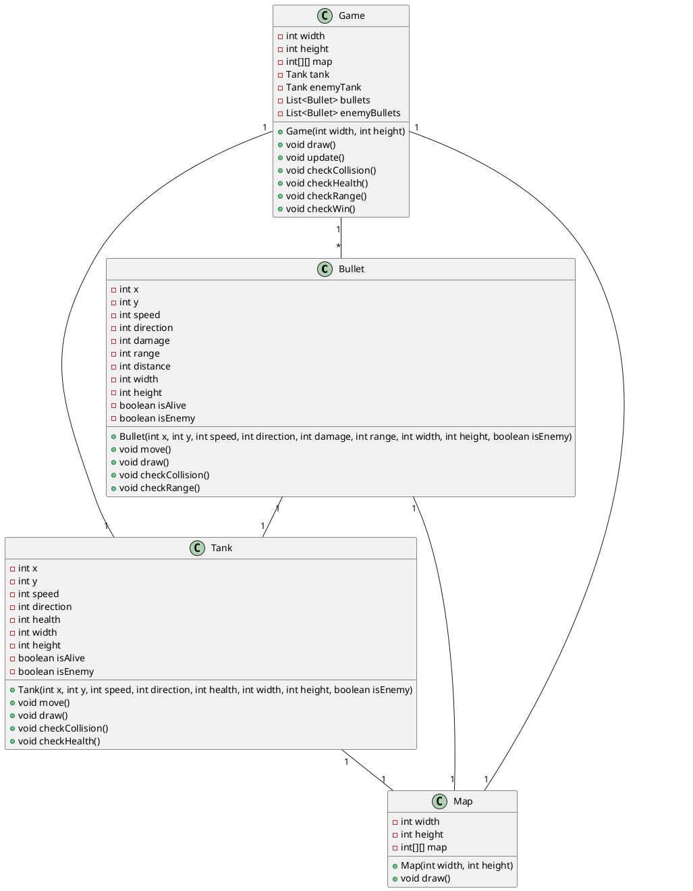

# Shooting Game Design

## Requirements

## Analysis
- Bullet
- Tank
- Map
- Game

## Design
### Class Diagram

```plantuml
@startuml
class Bullet {
    - int x
    - int y
    - int speed
    - int direction
    - int damage
    - int range
    - int distance
    - int width
    - int height
    - boolean isAlive
    - boolean isEnemy
    + Bullet(int x, int y, int speed, int direction, int damage, int range, int width, int height, boolean isEnemy)
    + void move()
    + void draw()
    + void checkCollision()
    + void checkRange()
}

class Tank {
    - int x
    - int y
    - int speed
    - int direction
    - int health
    - int width
    - int height
    - boolean isAlive
    - boolean isEnemy
    + Tank(int x, int y, int speed, int direction, int health, int width, int height, boolean isEnemy)
    + void move()
    + void draw()
    + void checkCollision()
    + void checkHealth()
}

class Map {
    - int width
    - int height
    - int[][] map
    + Map(int width, int height)
    + void draw()
}

class Game {
    - int width
    - int height
    - int[][] map
    - Tank tank
    - Tank enemyTank
    - List<Bullet> bullets
    - List<Bullet> enemyBullets
    + Game(int width, int height)
    + void draw()
    + void update()
    + void checkCollision()
    + void checkHealth()
    + void checkRange()
    + void checkWin()
}

Bullet "1" -- "1" Tank
Bullet "1" -- "1" Map
Tank "1" -- "1" Map
Game "1" -- "1" Map
Game "1" -- "1" Tank
Game "1" -- "*" Bullet
@enduml
```

